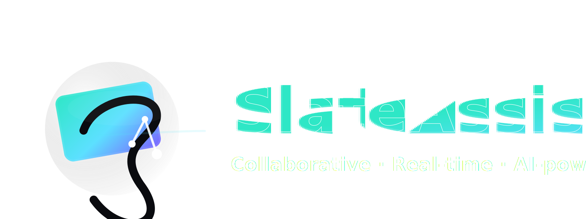
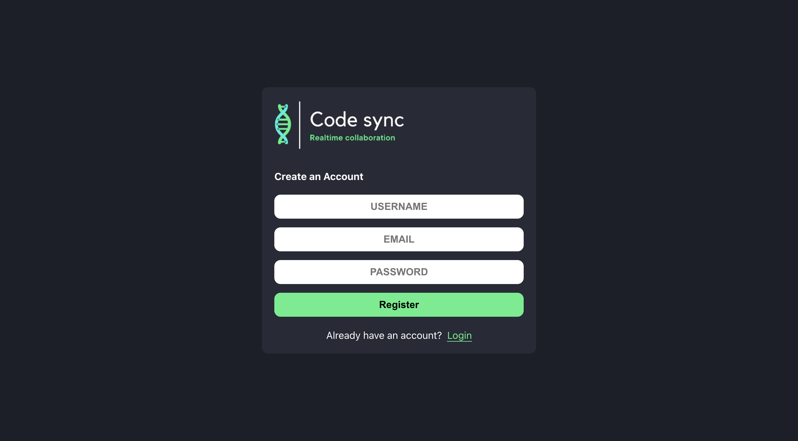
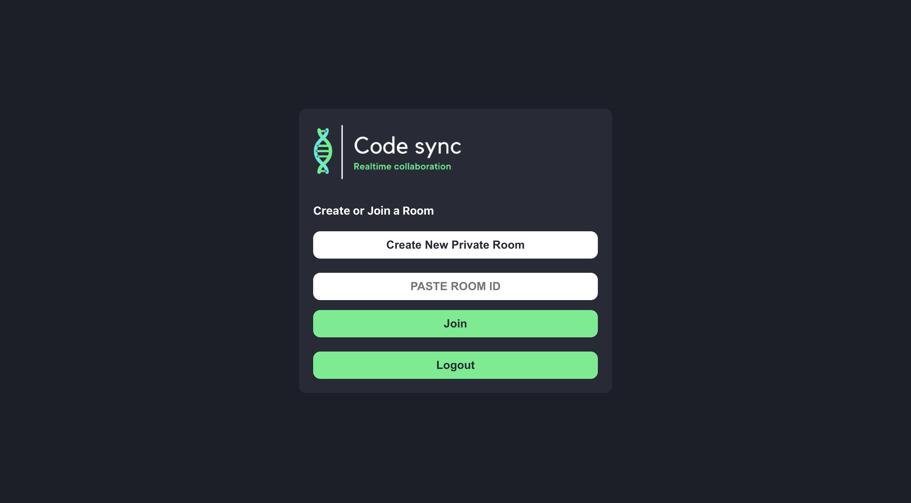
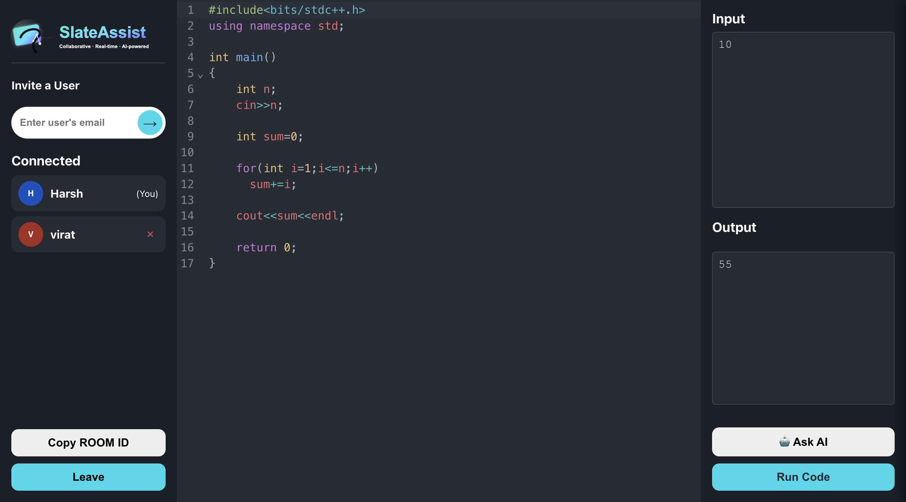
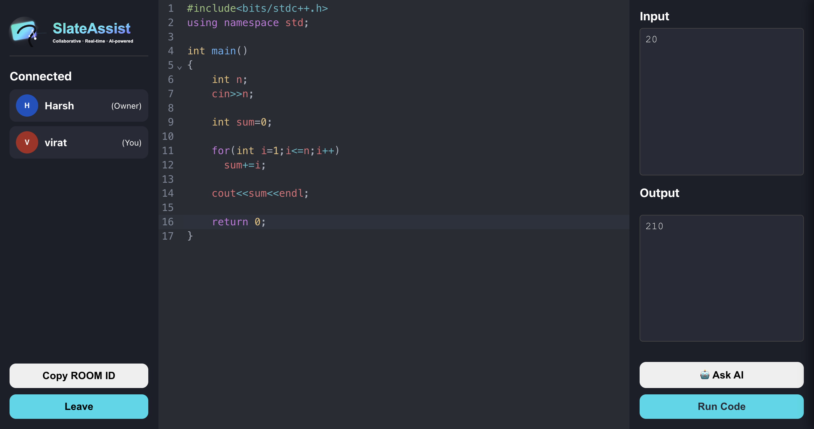
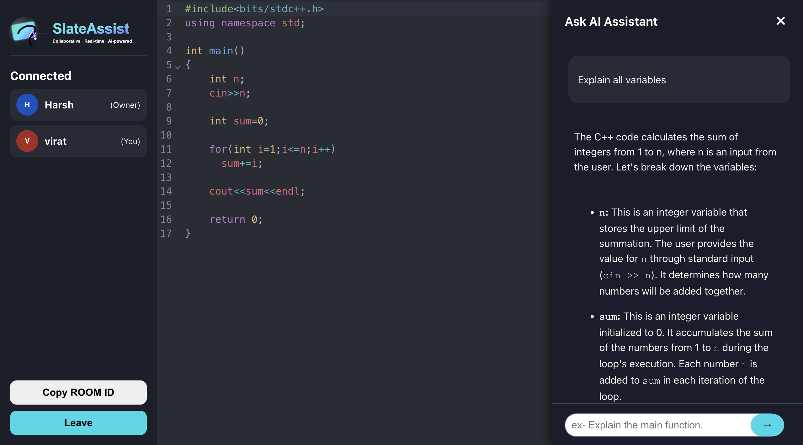

# 🚀✨ SlateAssist: AI-Assisted Collaborative Code Editor 🧠💻

**SlateAssist** is a cutting-edge, real-time collaborative code editor built with a powerful MERN stack and the magic of Socket.IO. 🧙‍♂️ Designed to supercharge your technical interviews and pair programming sessions, it enables multiple authenticated users to write ✍️, edit ✏️, and execute C++ code together in a synchronized environment, all while benefiting from an integrated AI assistant 🤖.

🔗 **Live Demo:** **<ins>[slateassist-live-demo.vercel.app](https://ai-realtime-collaborative-code-edit.vercel.app/)</ins>** 🌐

> ⚠️ **Heads Up!** The backend server, hosted on a free Render instance ☁️, might take a brief nap 😴 after inactivity. Allow up to 60 seconds for it to awaken on your first visit. Once it's up and running 🟢, prepare for a smooth and responsive experience!

---

  📸 <ins>**Showcase Your Awesome!**</ins> 📸
   
  

    
Click to see a sneak peek of SlateAssist! 👀

    
    
    
    
    
    
     
  

---

## ✨ Core Features - Dive Deeper! 🌊

SlateAssist isn't just about typing together; it's a comprehensive platform engineered for seamless and intelligent collaboration.

#### 1. ⚡ Real-time Collaboration Layer 🤝
* **💨 Instant Code Synchronization:** Leveraging the speed of WebSockets via Socket.IO 📡, every code change you make is instantly broadcasted to all collaborators in the room. Our server acts as the ultimate conductor 🎼, ensuring that newcomers are immediately in harmony with the latest code.
* **👤 Live Participant List - Who's Coding? 👀:** The dynamic sidebar provides a real-time roster of everyone in the coding room. Watch it update live 🔄 as teammates join the session ➕ or step away ➖, giving you a clear picture of your collaborative circle.

#### 2. 🛡️ Robust User Authentication & Security 🔒
* **🔑 Secure Registration & Login:** Create your account with peace of mind! User passwords are cryptographically protected using `bcrypt` 🛡️ before they find their home in our database 💾.
* **🔑 JWT-Powered Authorization:** We use JSON Web Tokens (JWT) to manage your coding sessions securely. Upon login ✅, you receive a unique token that verifies your identity for all subsequent actions, eliminating the need for constant database lookups and keeping your experience swift and secure.
* **🚧 Protected Pathways:** Both the client-side routes and the backend API endpoints are heavily guarded 🛡️. Only authenticated users with valid tokens can access the editor and its powerful features, ensuring a private and controlled coding environment.

#### 3. 🤖 Integrated AI Programming Assistant - Your Coding Companion! 🌟
* **💡 On-Demand AI Insights:** Need a coding guru by your side? Slide open the integrated AI assistant ✨, powered by the intelligent Google Gemini API 🧠.
* **🧠 Context-Aware Help:** Our AI isn't just a chatbot; it's context-aware! It intelligently analyzes the code in your editor 🧐, considers any provided standard input 📤, and remembers the output of your last execution 🎬 to provide truly relevant answers and suggestions. Ask it anything from "What's wrong with this loop?" to "How can I optimize this function?".
* **🤫 Secure API Handling:** Your sensitive Gemini API key remains a secret 🤫! The client never directly talks to Google. Instead, all AI requests are securely routed through our backend server, which adds the necessary credentials and protects your information.

#### 4. 🚀 Live C++ Code Execution - From Idea to Action! ▶️
* **⚙️ In-Browser Compilation & Execution:** Turn your code into reality with our integrated C++ execution engine! Send your code to the robust Judge0 API judge <0xF0><0x9F><0xA7><0xAE> for compilation and instant execution.
* **📤 Custom Standard Input (stdin):** Practice your competitive programming skills! A dedicated input panel lets you feed custom data into your C++ programs ⌨️, just like in a real coding environment.
* **🔒 Secure API Interactions:** Just like with the AI, your Judge0 API key is kept under lock and key 🗝️ on our backend. All execution requests are handled server-side to maintain security.

#### 5. 🛡️ Advanced Session & Room Management - Control & Stability! ⚙️
* **👑 Owner's Privileges:** The creator of a coding room wears the crown 👑! As the "owner," they have the exclusive power to invite new collaborators ✉️ and, if necessary, remove participants 🚪. This control is strictly enforced on the server.
* **🔄 "Silent Swap" for Seamless Sessions:** No more disruptive "user left" and "user joined" spam when you switch tabs! Our intelligent "Silent Swap" system ensures that if you rejoin a room from a different tab or device, your old session is seamlessly replaced 🔄 without anyone else even noticing. It's like magic! ✨
* **🚪 Cross-Tab Logout Synchronization:** Security and convenience go hand-in-hand! If you log out from SlateAssist in one browser tab, all your other open SlateAssist tabs will automatically log you out too 🚪, ensuring your session is fully closed everywhere.

#### 6. ✨ Polished User Interface - Coding in Style! 🎨
* **🏷️ Clear Role Identification:** Wondering who's in charge? The participant list clearly marks the **`(Owner)`** 👑 and highlights **`(You)`** 🙋, so everyone knows their role at a glance.
* **💬 Real-time Notifications (Toasts!):** Stay informed without interruption! Non-intrusive toast notifications 🍞 pop up to let you know when someone joins the room 👋 or leaves 🚶, keeping you in the loop.
* **📜 Ready-to-Code Boilerplate:** New coding rooms come pre-loaded with a basic C++ structure 뼈대, so you can jump straight into writing code without any setup!

---

## 🛠️ Technology & Architecture - Under the Hood! ⚙️

SlateAssist is built with a modern, decoupled architecture, designed for performance, scalability, and maintainability.

* **Frontend (Vite + React):** A blazing-fast 🔥 single-page application built with the latest React features, bundled by Vite 🚀. We use React Hooks and the Context API for efficient state management and React Router DOM for smooth navigation between pages. Real-time interactions are powered by the efficient Socket.IO Client 🔌.
* **Backend (Node.js + Express):** A robust and scalable backend built on Node.js with the Express.js framework 🏗️. It handles all API requests, manages WebSocket connections, enforces authentication, and acts as a secure intermediary for communicating with third-party AI and code execution services.
* **Database (MongoDB):** We use MongoDB 🍃, a flexible NoSQL database, managed with the Mongoose ODM (Object Data Modeling) library, to store user data and room information efficiently.
* **Real-time Communication (Socket.IO):** The heart ❤️ of SlateAssist's collaborative features! Socket.IO provides a persistent, low-latency WebSocket connection 🔗 for seamless, bi-directional communication between the frontend and backend.

---

## 🔧 Getting Started Locally - Your Local Coding Lab! 🧪

Ready to run SlateAssist on your own machine? Follow these simple steps!

1.  **Clone the repository:**
    git clone [https://github.com/Swaymbhu-git/SlateAssist.git](https://github.com/your-username/SlateAssist.git)
    cd SlateAssist

2.  **Setup the Backend:**
    * Navigate to the server directory: `cd server`
    * Install all the necessary packages: `npm install`
    * Create a `.env` file in the `server` directory and add your secret API keys and MongoDB connection string:
      MONGO_URI=your_mongodb_connection_string
      JWT_SECRET=your_jwt_secret_key
      GEMINI_API_KEY=your_gemini_api_key
      RAPIDAPI_KEY=your_rapidapi_key
    * Start the development server:
      npm run dev
      The server will be running on `http://localhost:5001`.

3.  **Setup the Frontend:**
    * Open a new terminal and navigate to the client directory: `cd client`
    * Install all frontend dependencies: `npm install`
    * Create a `.env` file in the `client` directory and specify the backend URL:
      VITE_BACKEND_URL=http://localhost:5001
    * Start the frontend development server:
      npm run dev
      The application will usually be live at `http://localhost:5173` (or another port provided by Vite).

---

## ☁️ Deployment - Taking SlateAssist to the World! 🚀

* **Frontend:** Deployed with the speed and simplicity of **<ins>[Vercel](https://vercel.com/)</ins>**.
* **Backend:** Running smoothly on the reliable infrastructure of **<ins>[Render](https://render.com/)</ins>**.

---

## 👤 Author - Meet the Creator! 👋

**Himanshu Patel**
* **GitHub:** <ins>[@Swaymbhu-git](https://github.com/Swaymbhu-git)</ins> 🐙
* **LinkedIn:** <ins>[linkedin.com/in/himanshu-patel-b62a64222/](https://www.linkedin.com/in/himanshu-patel-b62a64222/)</ins> 💼

---

## 📜 License - Open Source Love! ❤️

This project is proudly licensed under the MIT License. Feel free to use and contribute to SlateAssist!